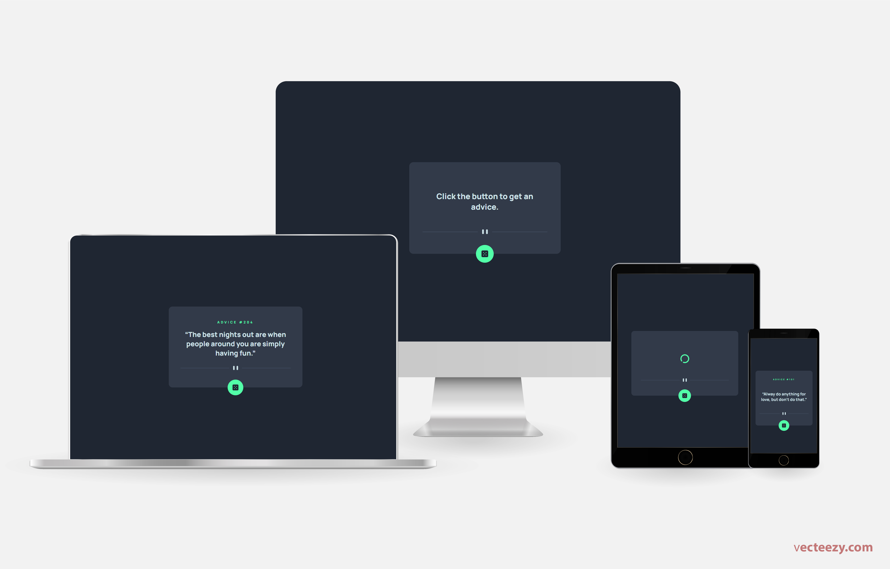
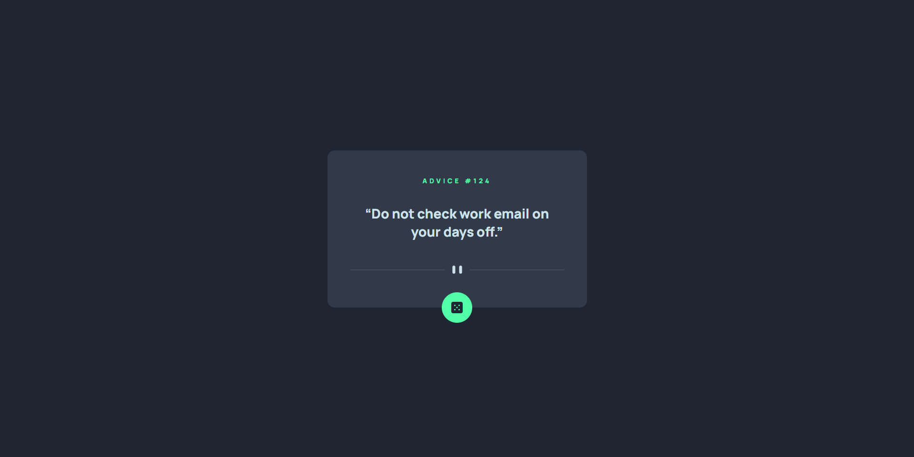

# Frontend Mentor - Advice generator app solution

This is my solution to the [Advice generator app on Frontend Mentor](https://www.frontendmentor.io/challenges/advice-generator-app-QdUG-13db). Frontend Mentor challenges help you improve your coding skills by building realistic projects. 



## Table of contents

- [Overview](#overview)
  - [The challenge](#the-challenge)
  - [Screenshot](#screenshot)
  - [Links](#links)
- [My process](#my-process)
  - [Built with](#built-with)
  - [What I learned](#what-i-learned)  
  - [Useful resources](#useful-resources)
- [Author](#author)
- [Acknowledgments](#acknowledgments)

## Overview

### The challenge

This app displays an advice every time the user clicks on the dice icon. Moreover, it is responsive, i.e., the layout adjusts itself to fit properly on different screen sizes.

This is my first project related to API consuming. More precisely, the advices showed up in this app are taken from a database through the [Advice Slip API](https://api.adviceslip.com/).

### Screenshot



### Links

- [Solution](https://github.com/Gabriel-Alves-95/Frontend-Mentor-Challenges/tree/main/advice-generator-app)
- [Live](https://advice-generator-gabriel-alves-dev.netlify.app/)

## My process

### Built with

- HTML 5
- CSS 3
- Vanilla JavaScript

### What I learned

I have learned the basics about API consuming, namely:

- The url pattern of REST API's
- JavaScript's fetch method to get the result of a request to a database via an API:

  ```js
  const response = await fetch(
    'https://api.adviceslip.com/advice',
    {
      method: 'GET'            		
    }
  ); 

  adviceJSON = await response.json();
  ```

### Useful resources

- [Understanding And Using REST APIs](https://www.smashingmagazine.com/2018/01/understanding-using-rest-api/) - This article by [Zell Liew](https://www.smashingmagazine.com/author/zellliew/) helped me with the first topic above. The author clearly explains all the four "building blocks" of a REST API request: endpoint, method, headers and data/body. 

- [How to use the Fetch API with async/await](https://rapidapi.com/guides/fetch-api-async-await) - It was through this article by [Ahmad Bilal](https://rapidapi.com/developers/ahmad-bilal) that I came to know the basics about fetch. I was able to connect with the database but I got stucked in acessing the slip object. As noted in this article, the problem was that I needed to specify the format in which the response should be given. In my case, I was seeking for a JSON object, so I added the piece 

  ```js
  const data = await response.json();
  ``` 
  to my code and problem solved.

## Author

- [Personal Website](https://gabriel-alves-dev.netlify.app/)
- [Frontend Mentor Profile](https://www.frontendmentor.io/profile/Gabriel-Alves-95)
- [Linkedin Profile](https://www.linkedin.com/in/gabriel-alves-webdev/)

## Acknowledgments

I thank the authors of the resources listed above for their work helped me to succeed in this project.

I would like to thank [Алексей Безродний](https://www.vecteezy.com/members/dezzzzy) for the image with several devices which I used, after some editing, to open this README. 

I also thank the platform [vecteezy.com](https://www.vecteezy.com/), where I found the aforementioned image.