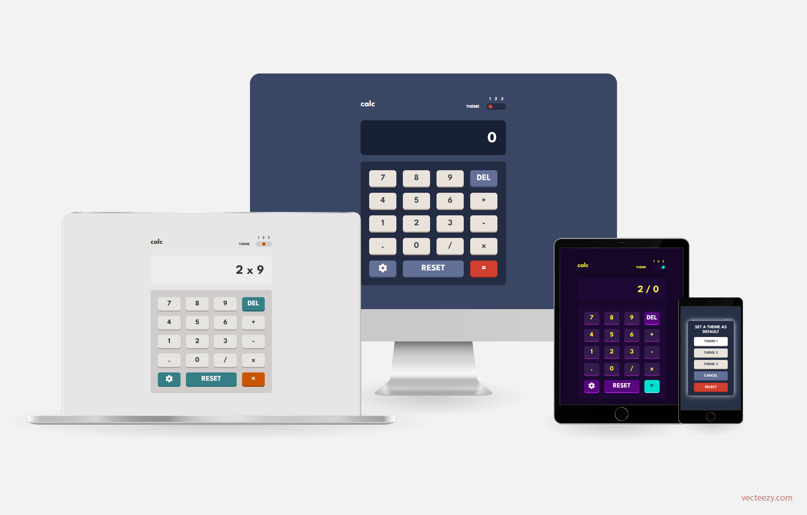

# Frontend Mentor - Calculator app solution

This is my solution to the [Calculator app challenge on Frontend Mentor](https://www.frontendmentor.io/challenges/calculator-app-9lteq5N29). Frontend Mentor challenges help you improve your coding skills by building realistic projects. 



## Table of contents

- [Overview](#overview)
  - [The challenge](#the-challenge)
  - [Screenshot](#screenshot)
  - [Links](#links)
- [My process](#my-process)
  - [Built with](#built-with)
  - [What I learned](#what-i-learned)  
  - [Useful resources](#useful-resources)
- [Author](#author)
- [Acknowledgments](#acknowledgments)

## Overview

### The challenge

Besides performing basic mathematical operations, this calculator is responsive and the user can choose between three color themes. There is a default color theme, namely the first. But the user may set any theme as default, if he/she prefers.

A styled horizontal scrollbar is displayed whenever either the underlying mathematical expression or the result of an operation is too large to exhibit on the screen, so preventing layout breaking and allowing the user to perform computations with large numbers.

### Screenshot


### Links

- [Solution](https://github.com/Gabriel-Alves-95/Frontend-Mentor-Challenges/tree/main/calculator-app)
- <a href="https://calculator-app-gabriel-alves-dev.netlify.app/" target="_blank">Live</a>
<!-- - [Live](https://calculator-app-gabriel-alves-dev.netlify.app/) -->

## My process

### Built with

- CSS
- React

### What I learned

While working on this project, I have learned:

- How to modify a state from the parent component when a child component's event is fired . This can be done by writing a function on App.js that modifies the aforementioned state and passing it as a prop of the underlying child. See the code snippet below.

  App.js

  ```jsx
    import React, { useState } from 'react';
    import Header from './components/header/Header';
    
    const [theme, setTheme] = useState( !localStorage.getItem('theme') ? '01' : localStorage.getItem('theme') );    
    const [displayedValue, setDisplayedValue] = useState('0');

    const handleThemeChange = () => {
      const toggle = document.getElementById('toggle');   
      setTheme('0' + toggle.value);
    };    

    return(

      <Header
        theme={theme}
        onChange={handleThemeChange}
      /> 

    );    
  ```
  
- How to style scrollbars using -webkit ( Chrome, Safari, Opera, Edge, ... ) and scrollbar-color, scrollbar-width ( Firefox ).

- How to style toggle buttons with booth -webkit and -moz.

- I have added a new CSS query to my list: @supports. I have also learned that we can nest @media and @supports queries. Such nesting was particurlarly useful to style scrollbars on Firefox, as one can see in the file screen.css.

### Useful resources

- <a href="https://www.freecodecamp.org/news/pass-data-between-components-in-react/" target="_blank">How to Pass Data and Events Between Components in React</a> - This article by  <a href="https://www.freecodecamp.org/news/author/nishant-kumar/" target="_blank">Nishant Kumar</a>  helped me to deal with the first topic above.

- <a href="https://www.youtube.com/watch?v=lvKK2fs6h4I&t=36s" target="_blank">Create custom scrollbars using CSS</a> - This YouTube video by <a href="https://www.youtube.com/kepowob" target="_blank">Kevin Powell</a> helped me with styling scrollbars on Firefox. The information I got on video interval 08:23-12:07 was very useful.
 
- <a href="https://css-tricks.com/can-you-nest-media-and-support-queries/" target="_blank">Can you nest @media and @support queries? </a> - I got to know we can nest these queries through this article authored by <a href="https://css-tricks.com/author/chriscoyier/" target="_blank">Chris Coyier </a>.

## Author

- [Personal Website](https://gabriel-alves-dev.netlify.app/)
- [Frontend Mentor Profile](https://www.frontendmentor.io/profile/Gabriel-Alves-95)
- [Linkedin Profile](https://www.linkedin.com/in/gabriel-alves-webdev/)

## Acknowledgments

I thank all the authors of the resources listed above, which I found useful in the course of this project.

I would like to thank [Алексей Безродний](https://www.vecteezy.com/members/dezzzzy) for the image with several devices which I used, after some editing, to open this README. I also thank the platform [vecteezy.com](https://www.vecteezy.com/), where I found the aforementioned image.