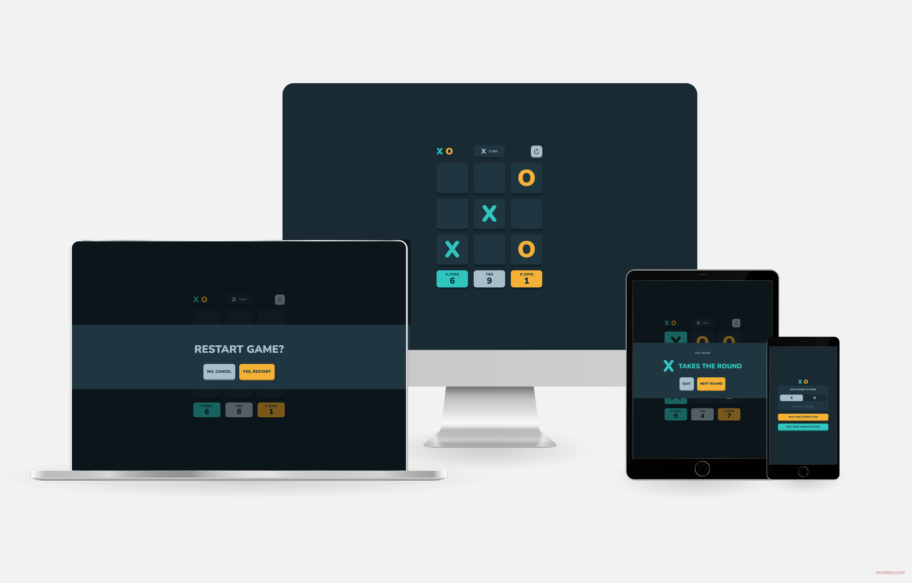
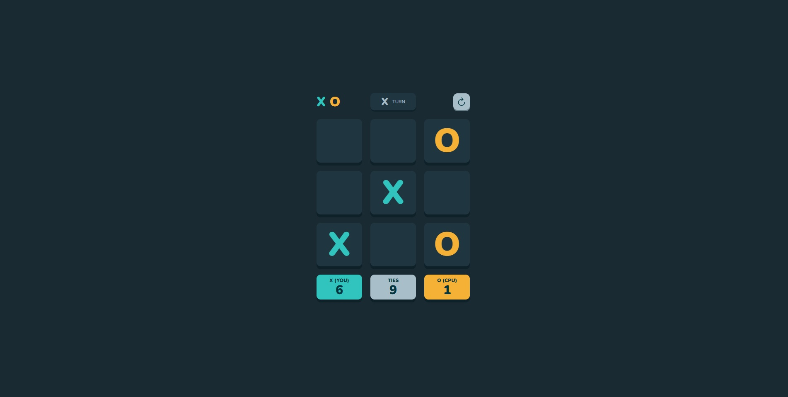

# Frontend Mentor - Tic Tac Toe game solution



This is my solution to the [Tic Tac Toe game challenge on Frontend Mentor](https://www.frontendmentor.io/challenges/tic-tac-toe-game-Re7ZF_E2v). Frontend Mentor challenges help you improve your coding skills by building realistic projects. 


## Table of contents

- [Overview](#overview)
  - [The challenge](#the-challenge)
  - [Screenshot](#screenshot)
  - [Links](#links)
- [My process](#my-process)
  - [Built with](#built-with)
  - [What I learned](#what-i-learned)
- [Author](#author)
- [Acknowledgments](#acknowledgments)

## Overview

### The challenge

This Tic Tac Toe game offers its user the possibility of playing against either the computer or another person. In the last case, i.e., when there are two persons playing, they have to share the same computer. Moreover, the game keeps and updates the scores and adjusts itself to different screen sizes.

The player can change his/her marker by clicking upon the turn button. He/she can also restart the game at any time, in which case the scores will be restarted too.  

Finally, there is no refreshing of the page between turns. Therefore, once the page is loaded, one can keep playing even if the internet connection shuts down.

### Screenshot



### Links

- [Solution](https://github.com/Gabriel-Alves-95/Frontend-Mentor-Challenges/tree/main/tic-tac-toe-game)
- [Live](https://tic-tac-toe-game-gabriel-alves-dev.netlify.app/)

## My process

### Built with

- HTML 5
- CSS 3
- Vanilla JavaScript

### What I learned

An imporant technique I have learned while coding this project is how to add and remove anonymous functions as events listeners for elements. This can be done by declaring the listener function as a constant, just like in the code below.

```js
const btnQuit = function() {DialogBoxLeftBtn(true)};


function DialogBoxLeftBtn(pQuitGame) { ...  

}
```

I have also learned how to work with local storage, which was needed to save the game settings chosen by the player.
## Author

- [Personal Website](https://gabriel-alves-dev.netlify.app/)
- [Frontend Mentor Profile](https://www.frontendmentor.io/profile/Gabriel-Alves-95)
- [Linkedin Profile](https://www.linkedin.com/in/gabriel-alves-webdev/)

## Acknowledgments

I would like to thank [Алексей Безродний](https://www.vecteezy.com/members/dezzzzy) for the image with several devices which I used, after some editing, to open this README. 

I also thank the platform [vecteezy.com](https://www.vecteezy.com/), where I found the aforementioned image.